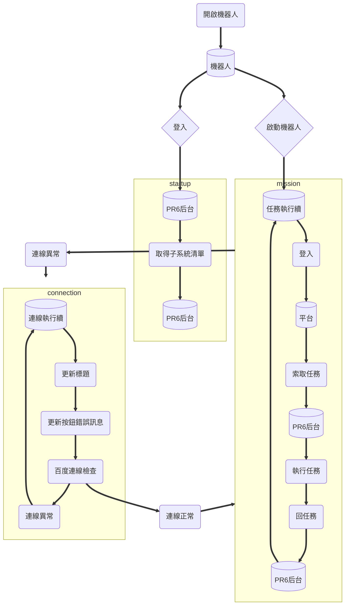

# 整合機器人說明文件

## 線上說明文件：
1. [整合機器人流程及參數說明](https://docs.google.com/document/d/1gzcwqZa3qgbW3iJM1OSluCXsJ6x4AFbC/edit#heading=h.1fob9te)
2. [整合機器人API規範](https://docs.google.com/spreadsheets/d/1EljCVk09xva4mx3WK7KM9KjpOP9-gIVfgXbXJIcH4UY/edit#gid=718643976)

## 基本說明:
* 目前已統整平台為: LEBO
  * LEBO已統整功能: 登入, 查詢會員層級, 查詢會員輸贏, 登入狀態檢查

## 第一次使用指令:
* `cd {workspace}`
* `conda create --name platform python=3.6`
* `conda activate platform`
* `pip install -r requirements.txt`
* `copy config\pure\setting.ddl config`
* `python main.py`

## 打包程式碼指令:
* `pyinstaller main.spec`


## 執行續執行順序架構
[![](https://mermaid.ink/img/eyJjb2RlIjoiZmxvd2NoYXJ0IFREXG4gIFJvYm90WyjmqZ_lmajkuropXVxuICBNaXNzaW9uWyjku7vli5nln7fooYznuowpXVxuICBDb25uZWN0aW9uWyjpgKPnt5rln7fooYznuowpXVxuICBBcGkxWyjns7vntbHlvozlj7ApXVxuICBBcGkyWyjns7vntbHlvozlj7ApXVxuICBVcmxbKOW5s-WPsCldXG5cbiAgU3RhcnQo6ZaL5ZWf5qmf5Zmo5Lq6KSA9PT4gUm9ib3RcbiAgUm9ib3QgPT0-IGxvZ2luQXBpe-eZu-WFpX0gPT0-IEFwaTFcbiAgUm9ib3QgPT0-IHJ1blJvYm90e-WVn-WLleapn-WZqOS6un0gPT0-IE1pc3Npb25cbiAgbWlzc2lvbiA9PT4gY29ubmVjdEVycm9yKOmAo-e3mueVsOW4uCkgPT0-IGNvbm5lY3Rpb25cbiAgY2FuQ29ubmVjdCA9PT4gY29ubmVjdFN1Y2Nlc3Mo6YCj57ea5q2j5bi4KSA9PT4gbWlzc2lvblxuXG4gIHN1YmdyYXBoIHN0YXJ0dXBcbiAgICBBcGkxID09PiBnYW1lTGlzdCjlj5blvpflrZDns7vntbHmuIXllq4pID09PiBBcGkxMVso57O757Wx5b6M5Y-wKV1cbiAgZW5kXG5cbiAgc3ViZ3JhcGggbWlzc2lvblxuICAgIEFwaTIxID09PiBNaXNzaW9uXG4gICAgTWlzc2lvbiA9PT4gbG9naW5Vcmwo55m75YWlKSA9PT4gVXJsXG4gICAgVXJsID09PiBnZXRUYXNrKOe0ouWPluS7u-WLmSkgPT0-IEFwaTJcbiAgICBBcGkyID09PiBydW5UYXNrKOWft-ihjOS7u-WLmSlcbiAgICBydW5UYXNrKOWft-ihjOS7u-WLmSkgPT0-IHJldHVyblRhc2so5Zue5Lu75YuZKSA9PT4gQXBpMjFbKOezu-e1seW-jOWPsCldXG4gIGVuZFxuXG4gIHN1YmdyYXBoIGNvbm5lY3Rpb25cbiAgICBjYW5Db25uZWN0ID09PiBjb25uZWN0RXJyb3IxKOmAo-e3mueVsOW4uCkgPT0-IENvbm5lY3Rpb25cbiAgICBDb25uZWN0aW9uID09PiB1cGRUaXRsZSjmm7TmlrDmqJnpoYwpXG4gICAgdXBkVGl0bGUgPT0-IHVwZEVycm9yTXNnKOabtOaWsOaMiemIlemMr-iqpOioiuaBrylcbiAgICB1cGRFcnJvck1zZyA9PT4gY2FuQ29ubmVjdCjnmb7luqbpgKPnt5rmqqLmn6UpXG4gIGVuZFxuIiwibWVybWFpZCI6eyJ0aGVtZSI6ImRlZmF1bHQifSwidXBkYXRlRWRpdG9yIjpmYWxzZX0)](https://mermaid-js.github.io/mermaid-live-editor/#/edit/eyJjb2RlIjoiZmxvd2NoYXJ0IFREXG4gIFJvYm90WyjmqZ_lmajkuropXVxuICBNaXNzaW9uWyjku7vli5nln7fooYznuowpXVxuICBDb25uZWN0aW9uWyjpgKPnt5rln7fooYznuowpXVxuICBBcGkxWyjns7vntbHlvozlj7ApXVxuICBBcGkyWyjns7vntbHlvozlj7ApXVxuICBVcmxbKOW5s-WPsCldXG5cbiAgU3RhcnQo6ZaL5ZWf5qmf5Zmo5Lq6KSA9PT4gUm9ib3RcbiAgUm9ib3QgPT0-IGxvZ2luQXBpe-eZu-WFpX0gPT0-IEFwaTFcbiAgUm9ib3QgPT0-IHJ1blJvYm90e-WVn-WLleapn-WZqOS6un0gPT0-IE1pc3Npb25cbiAgbWlzc2lvbiA9PT4gY29ubmVjdEVycm9yKOmAo-e3mueVsOW4uCkgPT0-IGNvbm5lY3Rpb25cbiAgY2FuQ29ubmVjdCA9PT4gY29ubmVjdFN1Y2Nlc3Mo6YCj57ea5q2j5bi4KSA9PT4gbWlzc2lvblxuXG4gIHN1YmdyYXBoIHN0YXJ0dXBcbiAgICBBcGkxID09PiBnYW1lTGlzdCjlj5blvpflrZDns7vntbHmuIXllq4pID09PiBBcGkxMVso57O757Wx5b6M5Y-wKV1cbiAgZW5kXG5cbiAgc3ViZ3JhcGggbWlzc2lvblxuICAgIEFwaTIxID09PiBNaXNzaW9uXG4gICAgTWlzc2lvbiA9PT4gbG9naW5Vcmwo55m75YWlKSA9PT4gVXJsXG4gICAgVXJsID09PiBnZXRUYXNrKOe0ouWPluS7u-WLmSkgPT0-IEFwaTJcbiAgICBBcGkyID09PiBydW5UYXNrKOWft-ihjOS7u-WLmSlcbiAgICBydW5UYXNrKOWft-ihjOS7u-WLmSkgPT0-IHJldHVyblRhc2so5Zue5Lu75YuZKSA9PT4gQXBpMjFbKOezu-e1seW-jOWPsCldXG4gIGVuZFxuXG4gIHN1YmdyYXBoIGNvbm5lY3Rpb25cbiAgICBjYW5Db25uZWN0ID09PiBjb25uZWN0RXJyb3IxKOmAo-e3mueVsOW4uCkgPT0-IENvbm5lY3Rpb25cbiAgICBDb25uZWN0aW9uID09PiB1cGRUaXRsZSjmm7TmlrDmqJnpoYwpXG4gICAgdXBkVGl0bGUgPT0-IHVwZEVycm9yTXNnKOabtOaWsOaMiemIlemMr-iqpOioiuaBrylcbiAgICB1cGRFcnJvck1zZyA9PT4gY2FuQ29ubmVjdCjnmb7luqbpgKPnt5rmqqLmn6UpXG4gIGVuZFxuIiwibWVybWFpZCI6eyJ0aGVtZSI6ImRlZmF1bHQifSwidXBkYXRlRWRpdG9yIjpmYWxzZX0)
<!--
[VSCode說明文件預覽流程圖擴充功能](https://marketplace.visualstudio.com/items?itemName=bierner.markdown-mermaid)

-->

## 程式架構
```
project
|
|  .gitignore             設定使用git檔時忽略的檔案
|  requirements.txt       程式所使用的第三方套件包
|  README.md              說明文件
|  setup.py               使用pip安裝/更新時讀取的檔案
|  log.py                 設定紀錄擋格式
|  main.py                程式啟動位置
|  main.spec              打包程式使用的spec檔
|
├─ config                 設定檔及紀錄檔目錄
|  |
|  |  log                 紀錄檔存放路徑
|  |  setting.json        設定檔原始格式, 並含有各欄位註解
|  |  setting.ddl         設定檔, 會隨著機器人保存而修改
|  |
|  └─ pure                乾淨設定檔存放路徑, 用來打包文件
|     |
|     |  log              空的紀錄擋存放路徑, 用來打包文件
|     └─ setting.ddl      乾淨設定檔, 用來打包文件
|
├─ gui                    機器人主邏輯、主畫面程式碼
|  |
|  |  __init__.py         打包本資料夾作為一個package
|  |  Apps.py             與PR6后台互動各項動作(登入、取任務、回任務等)
|  |  favicon.ico         機器人icon
|  |  frame.py            機器人畫面、執行續
|  └─ plugins.py          外掛式功能包(最小化視窗、加密Session)
|
└─ platforms              平台套件包
   |
   |  __init__.py         打包本資料夾作為一個package
   |  config.py           定義各項變數、版本號
   |
   └─ lebo                LEBO模組
      |
      |  __init__.py      打包本資料夾作為一個package
      |  mission.py       定義任務執行的邏輯內容
      |  utils.py         共用物件, 例session, headers等宣告
      └─ module.py        主要模組邏輯內容, 例login, member_level等
```
